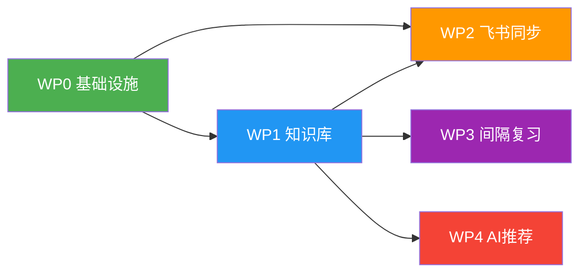

# Step 2 蓝图与拆解：AI自学知识管理系统

> 生成时间：2026-03-21
> 输入来源：Step 1 诊断报告
> 状态：已完成

---

## 一、目标分解结构图（WBS）

```
AI自学知识管理系统 MVP
│
├── WP0 项目基础设施（2天）
│   ├── T0.1 初始化 CLI 框架（Typer）
│   ├── T0.2 设计目录结构与数据模型
│   └── T0.3 搭建配置管理模块
│
├── WP1 知识库核心功能（4天）
│   ├── T1.1 笔记录入（新建/编辑 Markdown）
│   ├── T1.2 分类与标签管理
│   ├── T1.3 笔记索引与全文检索
│   └── T1.4 笔记列表与详情查看
│
├── WP2 飞书云端同步（2天）
│   ├── T2.1 修复飞书凭证（APP_SECRET）
│   ├── T2.2 封装飞书上传为 CLI 命令
│   └── T2.3 支持批量/增量同步
│
├── WP3 间隔复习提醒（3天）
│   ├── T3.1 实现艾宾浩斯遗忘曲线算法
│   ├── T3.2 复习计划生成与存储
│   └── T3.3 今日复习列表与完成标记
│
└── WP4 AI学习路径推荐（3天）
    ├── T4.1 接入 Claude API
    ├── T4.2 知识库内容分析与摘要
    └── T4.3 学习路径建议生成
```

---

## 二、工作包详细定义

### WP0 项目基础设施

| 属性 | 内容 |
|------|------|
| **负责人** | 基建工程组 |
| **工期** | 03-22 ~ 03-23（2天） |
| **前置依赖** | 无 |
| **交付物** | CLI 可运行骨架、目录结构、配置模块 |

**任务清单**：
| 任务 | 说明 | 验收标准 |
|------|------|----------|
| T0.1 初始化 CLI 框架 | 使用 Typer 搭建 CLI 入口，支持 `--help` | 运行 `python -m cli.main --help` 正常输出 |
| T0.2 设计目录结构 | 创建 `knowledge/`、`cli/`、`core/` 目录，定义数据模型 | 目录和 JSON schema 文件就位 |
| T0.3 配置管理模块 | 统一管理路径、API密钥等配置 | `from core.config import Config` 可用 |

---

### WP1 知识库核心功能

| 属性 | 内容 |
|------|------|
| **负责人** | 执行推进办 |
| **工期** | 03-24 ~ 03-27（4天） |
| **前置依赖** | WP0 |
| **交付物** | 完整的知识库 CRUD + 检索功能 |

**任务清单**：
| 任务 | 说明 | 验收标准 |
|------|------|----------|
| T1.1 笔记录入 | `kb add "标题" --tags "python,ai"` 创建 Markdown 笔记 | 成功创建文件 + 更新索引 |
| T1.2 分类与标签 | 支持 category/tag 两级分类，可按标签筛选 | `kb list --tag python` 正确过滤 |
| T1.3 全文检索 | 基于关键词搜索笔记内容 | `kb search "机器学习"` 返回匹配结果 |
| T1.4 笔记查看 | `kb show <id>` 查看笔记详情 | 终端正确渲染 Markdown |

---

### WP2 飞书云端同步

| 属性 | 内容 |
|------|------|
| **负责人** | 执行推进办 |
| **工期** | 03-28 ~ 03-29（2天） |
| **前置依赖** | WP0、WP1 |
| **交付物** | `sync feishu` 命令可将知识库同步至飞书 |

**任务清单**：
| 任务 | 说明 | 验收标准 |
|------|------|----------|
| T2.1 修复飞书凭证 | 重新获取 APP_SECRET，更新 `.env` | `feishu_final.py` 测试上传成功 |
| T2.2 封装 CLI 命令 | 将飞书上传逻辑封装为 `sync feishu` 命令 | 命令行可调用，输出上传结果 |
| T2.3 增量同步 | 仅同步新增/修改的笔记，避免重复上传 | 二次同步时跳过未变更文件 |

---

### WP3 间隔复习提醒

| 属性 | 内容 |
|------|------|
| **负责人** | 执行推进办 |
| **工期** | 03-30 ~ 04-01（3天） |
| **前置依赖** | WP1 |
| **交付物** | `review today` 展示今日待复习内容 |

**任务清单**：
| 任务 | 说明 | 验收标准 |
|------|------|----------|
| T3.1 遗忘曲线算法 | 实现间隔：1天、2天、4天、7天、15天、30天 | 单元测试通过 |
| T3.2 复习计划存储 | 每条笔记记录创建时间、复习次数、下次复习日期 | `review_schedule.json` 正确更新 |
| T3.3 今日复习列表 | `review today` 列出今日需复习笔记，`review done <id>` 标记完成 | 列表准确、标记后下次日期更新 |

---

### WP4 AI学习路径推荐

| 属性 | 内容 |
|------|------|
| **负责人** | 执行推进办 |
| **工期** | 04-02 ~ 04-04（3天） |
| **前置依赖** | WP1 |
| **交付物** | `learn suggest` 输出 AI 学习建议 |

**任务清单**：
| 任务 | 说明 | 验收标准 |
|------|------|----------|
| T4.1 接入 Claude API | 封装 API 调用，支持对话式交互 | API 调用返回正常响应 |
| T4.2 知识库分析 | 读取全部笔记，生成知识图谱摘要 | 输出已掌握知识领域列表 |
| T4.3 学习建议生成 | 基于现有知识，推荐下一步学习方向和资源 | `learn suggest` 输出结构化建议 |

---

## 三、里程碑计划表

```
日期        里程碑                    交付物                         关键路径
─────────────────────────────────────────────────────────────────────────────
03-22       M0 项目启动               开发环境就绪                    ★
03-23       M1 基础设施就绪           CLI骨架 + 目录结构              ★
03-27       M2 知识库可用             笔记CRUD + 全文检索             ★
03-29       M3 飞书同步可用           一键同步至飞书云端
04-01       M4 复习系统可用           间隔复习 + 今日待复习           ★
04-04       M5 MVP交付               AI推荐上线，全功能可用          ★
```

---

## 四、依赖关系图



**关键路径**：`WP0 → WP1 → WP3 → (完成)` 和 `WP0 → WP1 → WP4 → (完成)`

> WP2（飞书同步）和 WP3/WP4 可并行开发，但受限于个人开发，按串行排期。

---

## 五、质量检查

### 循环依赖检查
```
WP0 → WP1 → WP2    ✅ 无环
WP0 → WP1 → WP3    ✅ 无环
WP0 → WP1 → WP4    ✅ 无环
结论：无循环依赖
```

### 工作包分配检查
| 工作包 | 负责人 | 交付物明确 | 可独立验收 |
|--------|--------|-----------|-----------|
| WP0 | 基建工程组 | ✅ | ✅ |
| WP1 | 执行推进办 | ✅ | ✅ |
| WP2 | 执行推进办 | ✅ | ✅ |
| WP3 | 执行推进办 | ✅ | ✅ |
| WP4 | 执行推进办 | ✅ | ✅ |

**结论**：所有工作包已分配，无遗漏，交付物可验证。

---

## 六、风险与缓冲

| 风险场景 | 缓冲策略 |
|----------|----------|
| WP1 超时（知识库比预期复杂） | 压缩 WP4 时间或将 AI 推荐降级为 v2 |
| 飞书凭证无法修复 | WP2 降级为本地导出 JSON，跳过飞书 |
| API 调用成本超预期 | WP4 改用本地规则引擎替代 AI 分析 |

---

*本蓝图由 Step 2 流程自动生成。下一步请执行 `/step3-strategy` 制定详细策略。*
